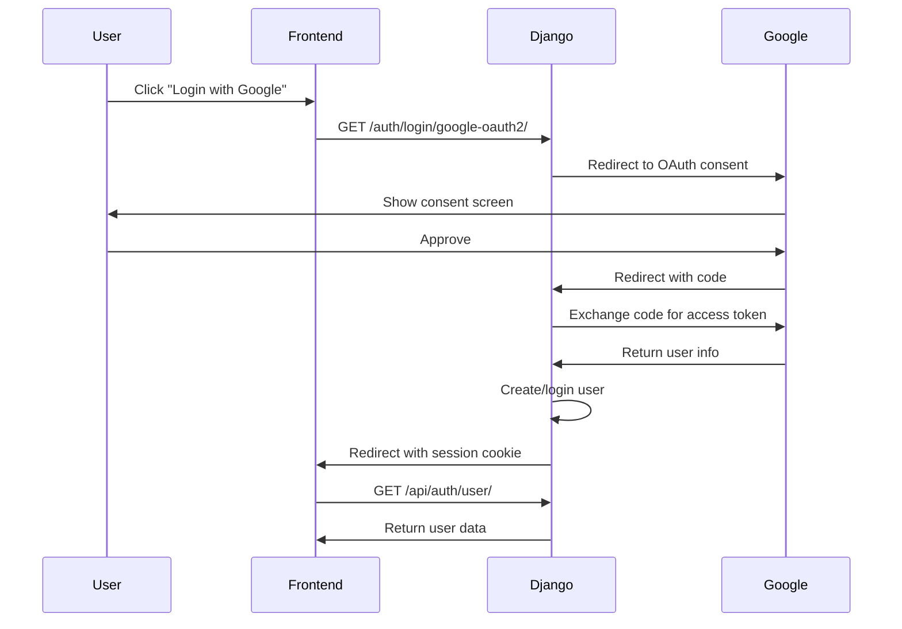

# Social Authentication Setup Guide

## Overview
The application now supports OAuth login with Google, Facebook, and GitHub!

## Backend Setup

### 1. Install Required Packages
```bash
cd backend
pip install social-auth-app-django social-auth-core
python manage.py migrate  # Creates social auth tables
```

### 2. Get OAuth Credentials

#### Google OAuth2
1. Go to [Google Cloud Console](https://console.cloud.google.com/)
2. Create a new project or select existing one
3. Enable "Google+ API"
4. Go to "Credentials" → "Create Credentials" → "OAuth 2.0 Client ID"
5. Application type: "Web application"
6. Authorized redirect URIs:
   - `http://localhost:8000/auth/complete/google-oauth2/`
   - `http://your-domain.com/auth/complete/google-oauth2/` (production)
7. Copy **Client ID** and **Client Secret**

#### Facebook OAuth2
1. Go to [Facebook Developers](https://developers.facebook.com/)
2. Create a new app → "Consumer" type
3. Add "Facebook Login" product
4. Settings → Basic: Copy **App ID** and **App Secret**
5. Settings → Facebook Login:
   - Valid OAuth Redirect URIs:
     - `http://localhost:8000/auth/complete/facebook/`
     - `http://your-domain.com/auth/complete/facebook/` (production)

#### GitHub OAuth2
1. Go to [GitHub Settings](https://github.com/settings/developers)
2. "OAuth Apps" → "New OAuth App"
3. Fill in:
   - Application name: Your App Name
   - Homepage URL: `http://localhost:8000`
   - Authorization callback URL: `http://localhost:8000/auth/complete/github/`
4. Copy **Client ID** and **Client Secret**

### 3. Configure Environment Variables

Add to your `.env` file:

```env
# Google OAuth2
GOOGLE_OAUTH2_CLIENT_ID=your_google_client_id_here
GOOGLE_OAUTH2_CLIENT_SECRET=your_google_client_secret_here

# Facebook OAuth2
FACEBOOK_APP_ID=your_facebook_app_id_here
FACEBOOK_APP_SECRET=your_facebook_app_secret_here

# GitHub OAuth2
GITHUB_CLIENT_ID=your_github_client_id_here
GITHUB_CLIENT_SECRET=your_github_client_secret_here

# Frontend URL (for redirects)
FRONTEND_URL=http://localhost:5173

# HTTPS redirect (set to True in production)
SOCIAL_AUTH_REDIRECT_IS_HTTPS=False
```

## Frontend Integration

The social login buttons are already integrated in the AuthModal component. They currently redirect to:
- Google: `/auth/login/google-oauth2/`
- Facebook: `/auth/login/facebook/`
- GitHub: `/auth/login/github/`

### Update Social Login Buttons

In `authModal.tsx`, update the button onClick handlers (around line 375):

```typescript
{/* Google */}
<button 
  type="button" 
  onClick$={() => window.location.href = 'http://localhost:8000/auth/login/google-oauth2/'}
  class="flex items-center justify-center px-4 py-2 border rounded-lg hover:bg-gray-50"
>
  {/* Google icon */}
</button>

{/* Facebook */}
<button 
  type="button"
  onClick$={() => window.location.href = 'http://localhost:8000/auth/login/facebook/'}
  class="flex items-center justify-center px-4 py-2 border rounded-lg hover:bg-gray-50"
>
  {/* Facebook icon */}
</button>

{/* GitHub */}
<button 
  type="button"
  onClick$={() => window.location.href = 'http://localhost:8000/auth/login/github/'}
  class="flex items-center justify-center px-4 py-2 border rounded-lg hover:bg-gray-50"
>
  {/* GitHub icon */}
</button>
```

## How It Works

1. **User clicks social login button** → Redirects to provider (Google/Facebook/GitHub)
2. **User authorizes** → Provider redirects to `/auth/complete/[provider]/`
3. **Django creates/logs in user** → Establishes session
4. **User redirected to frontend** → Logged in!

## Authentication Flow



## Session Handling

Social auth automatically creates Django sessions. The frontend can check login status by calling:
```typescript
const user = await authApi.getCurrentUser();
```

## Customization

### Associate Social Accounts with Existing Users

The pipeline automatically associates social accounts with existing users via email (see `SOCIAL_AUTH_PIPELINE` in settings).

### Disconnect Social Accounts

Add to `api/auth_views.py`:
```python
@method_decorator(login_required)
def disconnect_social_auth(request, provider, association_id):
    user = request.user
    try:
        user.social_auth.get(id=association_id, provider=provider).delete()
        return JsonResponse({'status': 'ok'})
    except UserSocialAuth.DoesNotExist:
        return JsonResponse({'status': 'not_found'}, status=404)
```

## Production Checklist

- [ ] Set `SOCIAL_AUTH_REDIRECT_IS_HTTPS=True`
- [ ] Update redirect URIs in provider consoles with production domain
- [ ] Use environment variables for all secrets (never commit to git)
- [ ] Set `SESSION_COOKIE_SECURE=True` in Django settings
- [ ] Enable HTTPS on your domain

## Troubleshooting

**"Redirect URI mismatch"**
- Ensure redirect URIs in provider console exactly match Django's callback URLs
- Check for http vs https
- Verify port numbers match

**"Social account already in use"**
- The email from the social provider matches an existing user
- Pipeline will automatically associate them if emails match

**Session Issues**
- Ensure `CORS_ALLOW_CREDENTIALS = True`
- Frontend must use `credentials: 'include'` in fetch requests
- Check cookie settings (SameSite, Secure, HttpOnly)

## References

- [Python Social Auth Documentation](https://python-social-auth.readthedocs.io/)
- [Django Social Auth](https://github.com/python-social-auth/social-app-django)
